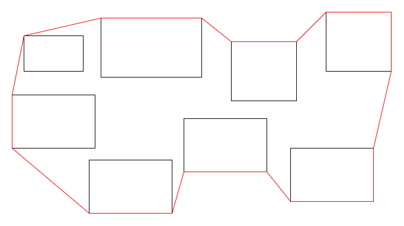
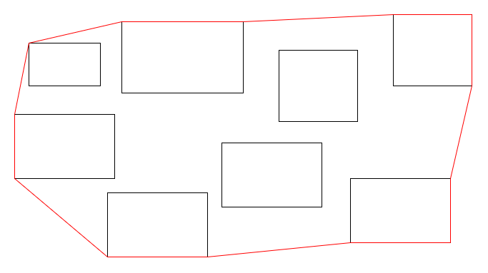

# Optimal Patrol Path Around Machines

## 1. Mathematical Explanation

### (a) Transforming the rectangle problem into a point problem

Each rectangle is axis-aligned and represented by two opposite corners:

$$
(x_1, y_1), (x_2, y_2)
$$

From these, we can construct all four corners:

$$
(x_1,y_1), (x_1,y_2), (x_2,y_1), (x_2,y_2)
$$

So for **N** rectangles, we generate: 4N points.

This transformation is valid because:

- A rectangle is completely determined by its corner points.
- Every point inside a rectangle is a convex combination of its corners.
- If all four corners are enclosed by a polygon, then the whole rectangle is enclosed.

Thus, the problem becomes:

> Find the shortest simple closed polygon enclosing all rectangle corner points.

---

### (b) Why the convex hull is the optimal patrol path

The shortest simple closed polygon enclosing a set of points must be convex.

Suppose the boundary is not convex.



Then there exists a concave section (an inward dent).

By replacing that dent with a straight line segment:

- all points remain enclosed,
- the total boundary length becomes shorter or remains the same.



So any non-convex boundary is not optimal.

Therefore:

> The optimal patrol path must be convex.

Since rectangles are fully represented by their corners:

> The optimal patrol path is the boundary of the convex hull of all rectangle corners.

---

### (c) Convex Hull Algorithm — Andrew’s Monotone Chain

**Andrew’s Monotone Chain Algorithm** computes the convex hull in:

$$
O(M \log M)
$$

where:

$$
M = 4N
$$

---

#### Step 1: Sort all points

Sort by:

1. x-coordinate
2. y-coordinate (if x is equal)

Why?

The core of the algorithm relies on the 2D Cross Product to check if three consecutive points make a "left turn" or a "right turn". This test only works if the points are processed in their natural geometric order along the $x$-axis. Sorting allows us to process points from left to right to build the lower hull, and right to left to build the upper hull.

Sorting cost:

$$
O(M \log M)
$$

---

#### Step 2: Build the lower hull

Traverse points from left to right.

For each point:

- Add it to the hull.
- While the last three points make a non-left turn, remove the middle point.

This ensures convexity.

---

#### Step 3: Build the upper hull

Repeat the same process from right to left after process reach to right most point.

---

#### Step 4: Merge lower and upper hulls

Combine them (excluding duplicate endpoints).

This produces the full convex hull.

---

### Time Complexity

Total points:

$$
M = 4N
$$

Sorting:

$$
O(M \log M)
$$

Hull construction:

$$
O(M)
$$

Total:

$$
O(M \log M)
$$

Since:

$$
M = 4N
$$

Final complexity:

$$
O(N \log N)
$$

---

## 2. Mathematical Formulas

### Cross Product / Orientation Test

For three points:

$$
O(x_o,y_o), A(x_a,y_a), B(x_b,y_b)
$$

The cross product is:

$$
(A-O)\times(B-O)
$$

Formula:

$$
(x_a-x_o)(y_b-y_o)-(y_a-y_o)(x_b-x_o)
$$

Interpretation:

- Positive → Counterclockwise turn
- Negative → Clockwise turn
- Zero → Collinear

---

### Euclidean Distance

For two points:

$$
A(x_1,y_1), B(x_2,y_2)
$$

Distance:

$$
d(A,B)=\sqrt{(x_2-x_1)^2+(y_2-y_1)^2}
$$

---

### Convex Hull Perimeter

If hull points are:

$$
P_1, P_2, ..., P_k
$$

Perimeter:

$$
\sum_{i=1}^{k} d(P_i,P_{i+1})
$$

where:

$$
P_{k+1}=P_1
$$

to close the polygon.

---

## 3. Java Implementation

```java
import java.io.*;
import java.util.*;

public class Main {

    static class Point implements Comparable<Point> {
        double x, y;

        Point(double x, double y) {
            this.x = x;
            this.y = y;
        }

        @Override
        public int compareTo(Point other) {
            if (this.x == other.x) {
                return Double.compare(this.y, other.y);
            }
            return Double.compare(this.x, other.x);
        }

        @Override
        public boolean equals(Object obj) {
            if (!(obj instanceof Point)) return false;
            Point p = (Point) obj;
            return Double.compare(x, p.x) == 0 &&
                   Double.compare(y, p.y) == 0;
        }

        @Override
        public int hashCode() {
            return Objects.hash(x, y);
        }
    }

    static double cross(Point O, Point A, Point B) {
        return (A.x - O.x) * (B.y - O.y)
             - (A.y - O.y) * (B.x - O.x);
    }

    static double distance(Point A, Point B) {
        double dx = A.x - B.x;
        double dy = A.y - B.y;
        return Math.sqrt(dx * dx + dy * dy);
    }

    static List<Point> convexHull(List<Point> points) {
        Collections.sort(points);

        List<Point> unique = new ArrayList<>();
        for (Point p : points) {
            if (unique.isEmpty() || !p.equals(unique.get(unique.size() - 1))) {
                unique.add(p);
            }
        }

        int n = unique.size();

        if (n <= 1) return unique;

        List<Point> lower = new ArrayList<>();
        for (Point p : unique) {
            while (lower.size() >= 2 &&
                    cross(
                        lower.get(lower.size() - 2),
                        lower.get(lower.size() - 1),
                        p
                    ) <= 0) {
                lower.remove(lower.size() - 1);
            }
            lower.add(p);
        }

        List<Point> upper = new ArrayList<>();
        for (int i = n - 1; i >= 0; i--) {
            Point p = unique.get(i);

            while (upper.size() >= 2 &&
                    cross(
                        upper.get(upper.size() - 2),
                        upper.get(upper.size() - 1),
                        p
                    ) <= 0) {
                upper.remove(upper.size() - 1);
            }
            upper.add(p);
        }

        lower.remove(lower.size() - 1);
        upper.remove(upper.size() - 1);

        lower.addAll(upper);

        return lower;
    }

    static double perimeter(List<Point> hull) {
        int n = hull.size();

        if (n == 1) return 0.0;

        if (n == 2) {
            return 2.0 * distance(hull.get(0), hull.get(1));
        }

        double perim = 0.0;

        for (int i = 0; i < n; i++) {
            perim += distance(hull.get(i), hull.get((i + 1) % n));
        }

        return perim;
    }

    public static void main(String[] args) throws Exception {
        BufferedReader br = new BufferedReader(new InputStreamReader(System.in));

        int N = Integer.parseInt(br.readLine().trim());

        List<Point> points = new ArrayList<>(4 * N);

        for (int i = 0; i < N; i++) {
            StringTokenizer st = new StringTokenizer(br.readLine());

            double x1 = Double.parseDouble(st.nextToken());
            double y1 = Double.parseDouble(st.nextToken());
            double x2 = Double.parseDouble(st.nextToken());
            double y2 = Double.parseDouble(st.nextToken());

            double lx = Math.min(x1, x2);
            double rx = Math.max(x1, x2);
            double by = Math.min(y1, y2);
            double ty = Math.max(y1, y2);

            points.add(new Point(lx, by));
            points.add(new Point(lx, ty));
            points.add(new Point(rx, by));
            points.add(new Point(rx, ty));
        }

        List<Point> hull = convexHull(points);

        double answer = perimeter(hull);

        System.out.printf("%.10f%n", answer);
    }
}
```

## Complexity Analysis

### Time Complexity

Generating points:

$$
O(N)
$$

Sorting:

$$
O(N \log N)
$$

Convex hull construction:

$$
O(N)
$$

Perimeter computation:

$$
O(N)
$$

Total:

$$
O(N \log N)
$$

---

### Space Complexity

Points storage:

$$
O(N)
$$

Hull storage:

$$
O(N)
$$

Total:

$$
O(N)
$$
